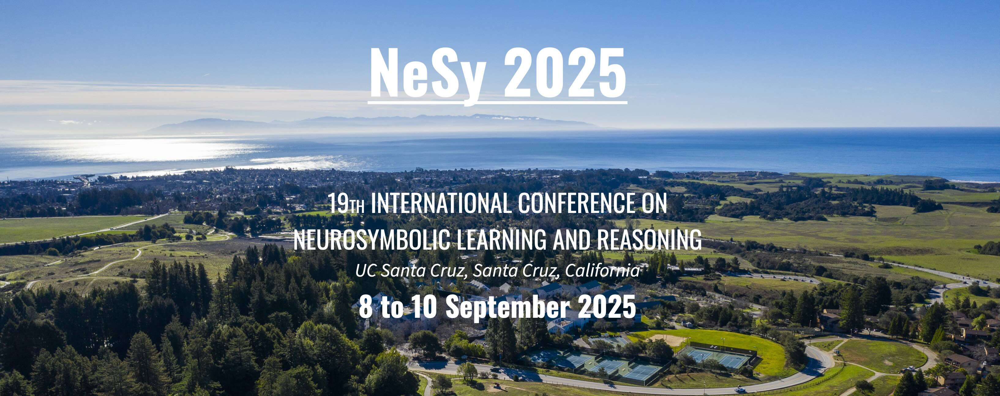

---
# Feel free to add content and custom Front Matter to this file.
# To modify the layout, see https://jekyllrb.com/docs/themes/#overriding-theme-defaults

permalink: /
title: NeSy Association 
fulltitle: Neurosymbolic Learning and Reasoning Association
layout: home
---

This year, [**NeSy 2025**](https://2025.nesyconf.org) will be held in **Santa Cruz, California, from September 8th to 10th.** Please see the [call for papers](https://2025.nesyconf.org/call-for-papers/) for more details.

The NeSy series is the longest standing gathering for the presentation and discussion of cutting-edge research in [neurosymbolic AI](https://people.cs.ksu.edu/~hitzler/nesy/). NeSy is the annual meeting of the **Neurosymbolic Learning and Reasoning Association**.

### About the Association 
NeSy is about the integration of neural and symbolic AI, combining statistical machine learning based on neural networks with knowledge representation and reasoning from symbolic AI. 
Neural networks and statistical Machine Learning have achieved industrial relevance in a number of areas from healthcare to finance and business, obtaining state-of-the-art performance at language modelling, speech and image recognition, sensor data and graph analytics. Symbolic AI is challenged by such unstructured large data, but offers sound and well-understood formal reasoning and explanation via knowledge representation that can be inspected to interpret how decisions follow from data. Neural and symbolic AI approaches also contrast in the problems that they excel at: deep learning excels at scene recognition, but fails at planning and rich deductive reasoning.

Neurosymbolic AI aims to build rich computational AI models, systems and applications by combining neural and symbolic learning and reasoning. It hopes to create synergies among the strengths of neural and symbolic AI while overcoming their complementary weaknesses. The NeSy conference series is the premier venue for the presentation and discussion of the theory and practice of neurosymbolic computing. Since the first NeSy in 2005, back then a workshop, the series provided an atmosphere for the free exchange of ideas, bringing together the community of scientists and practitioners that straddle the line between connectionist and symbolic AI. 

### Conference series on Neurosymbolic Learning and Reasoning
- [NeSy 2025](https://2025.nesyconf.org)
- [NeSy 2024](https://sites.google.com/view/nesy2024)

### Journal on Neurosymbolic Artificial Intelligence
[Neurosymbolic Artificial Intelligence (NAI) journal](https://neurosymbolic-ai-journal.com/), IOS Press, founded 2023

### Workshop series on Neurosymbolic Learning and Reasoning
- [NeSy 2023](https://sites.google.com/view/nesy2023)
- [NeSy 2022](https://sites.google.com/view/nesy-2022/home)
- [NeSy 2020/2021](https://sites.google.com/view/nesy20/home)
- [NeSy 2019](https://sites.google.com/view/nesy2019/home)

### Community 
To join the community slack, please send an email to Pascal Hitzler at [hitzler@ksu.edu](mailto:hitzler@ksu.edu) and you will receive an invitation. We also have a low-traffic mailing list for announcements and discussions related to neural-symbolic integration. Please visit [https://www.jiscmail.ac.uk/cgi-bin/wa.exe?A0=NESY](https://www.jiscmail.ac.uk/cgi-bin/wa.exe?A0=NESY) to add yourself to this list.